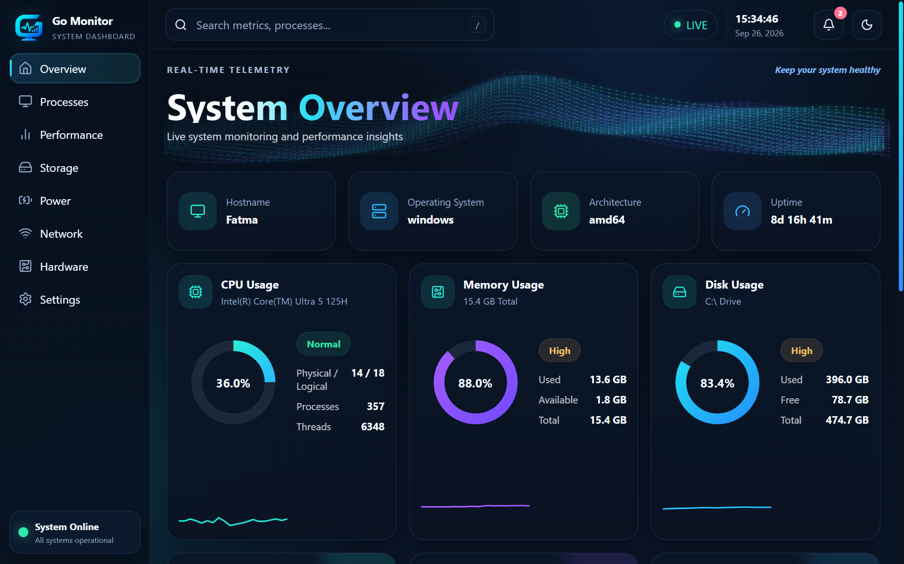

# Go System Monitor || 🖥️

A real-time system monitoring dashboard built with **Go**, **React**, **TypeScript**, and **Vite**.

<p align="center">
  
</p>

Go System Monitor combines a lightweight Go backend with a responsive desktop dashboard to visualize live hardware and system telemetry on Windows.

## ✨ Highlights

- Real-time CPU usage monitoring
- Physical and logical CPU core information
- Live process and thread counts
- Memory usage, available memory, and total RAM
- Disk usage, free space, and total capacity
- System uptime
- Hostname, operating system, and architecture information
- Network connection status and live upload/download throughput
- Battery & power information
- Dashboard render FPS monitoring
- Resource history charts
- Resource comparison chart
- System health and status indicators
- Searchable dashboard navigation
- Notification panel for high resource usage
- Dark and light themes
- Animated telemetry wave interface
- Responsive layout for different screen sizes

## 🛠️ Tech Stack

### Backend
- **Go**
- **gopsutil**
- `net/http`
- JSON REST API

### Frontend
- **React**
- **TypeScript**
- **Vite**
- **Recharts**
- **Lucide React**

## 🚀 Running the Project

### Requirements

Make sure the following are installed:

- Go
- Node.js
- npm

### 1. Start the Go backend

From the project root:

```powershell
go mod tidy
go run .
```

The backend runs at:

```text
http://localhost:8080
```

### 2. Start the frontend

Open a second terminal:

```powershell
cd web
npm install
npm run dev
```

Then open:

```text
http://localhost:5173
```

## 🔌 API Endpoints

### System information

```http
GET /api/system
```

Returns basic machine information such as hostname, operating system, and architecture.

### Live metrics

```http
GET /api/metrics
```

Returns current system telemetry including CPU, memory, disk, uptime, network, and power-related information.

## 📊 Dashboard

The dashboard is organized around three groups:

- **System Overview** — hostname, OS, architecture, and uptime
- **Resource Monitoring** — CPU, memory, and disk usage
- **Extended Telemetry** — battery/power, dashboard FPS, and network activity

The lower section includes resource history, resource comparison, and overall system status.

## 📁 Project Structure

```text
go-system-monitor/
├── main.go
├── go.mod
├── go.sum
├── start-dev.ps1
├── check-battery.ps1
├── web/
│   ├── public/
│   ├── src/
│   │   ├── App.tsx
│   │   ├── App.css
│   │   ├── index.css
│   │   └── main.tsx
│   ├── package.json
│   └── vite.config.ts
└── screenshots/
    └── go-system-monitor.png
```

## ⚙️ Notes

Some battery-related values depend on what the Windows battery driver exposes on the current device. Unsupported values are handled gracefully instead of displaying fabricated telemetry.

Network speed values represent **current network throughput**, not the maximum speed of the internet connection.

Dashboard FPS represents the rendering performance of the monitoring interface itself.

## 🎯 Project Goal

This project was developed as a practical Go learning project focused on:

- system programming concepts
- REST API development
- real-time telemetry
- frontend/backend integration
- responsive dashboard design
- Git and GitHub workflow

---

<p align="center">
  Built with Go • React • TypeScript
</p>
